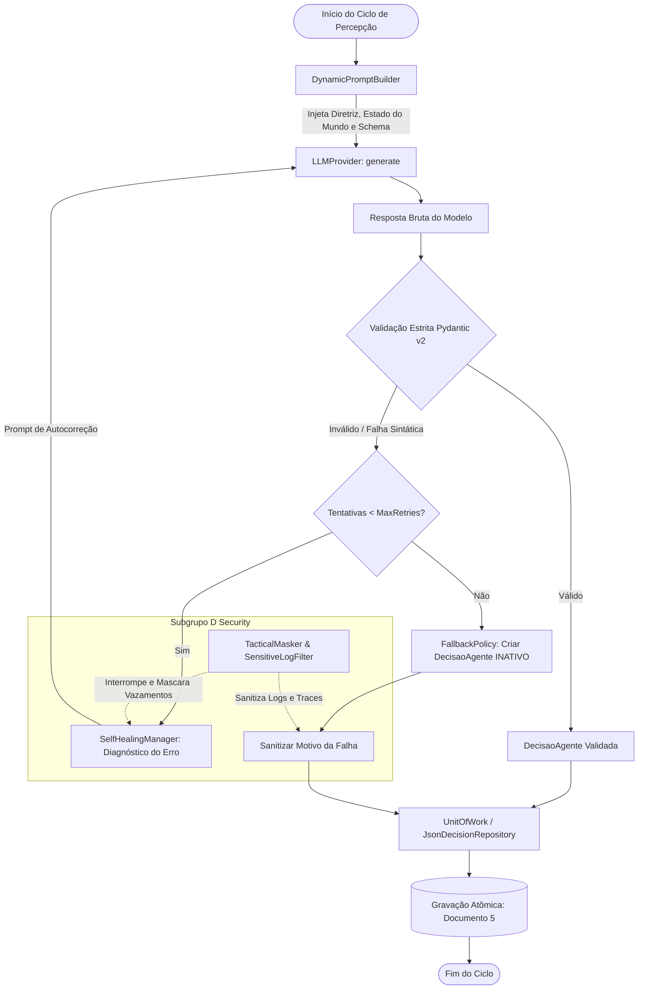
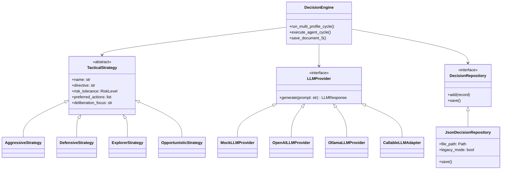

# 🧠 COGNIS: Motor de Decisão de Agentes Autônomos

<p align="center">
  <strong>Pipeline Deliberativo Multiagente de Alta Maturidade para Pesquisa e Produção</strong><br>
  <em>Iniciação Científica em Sistemas Multiagentes & Inteligência Artificial (Subgrupo C & Subgrupo D)</em><br>
  <strong>Autores:</strong> Calebe Ferreira Carvalho & Marcos de Oliveira Campos (Subgrupo C)
</p>

<p align="center">
  
  
  
  
  
  
</p>

---

## 📑 Sumário

- [Visão Geral](#-visão-geral)
- [Contexto Científico & Requisitos](#-contexto-científico--requisitos)
- [Arquitetura & Design Patterns](#-arquitetura--design-patterns)
  - [Fluxo Operacional do Ciclo](#fluxo-operacional-do-ciclo-percepção-decisão)
  - [Diagrama de Componentes](#diagrama-de-componentes)
- [Estrutura do Projeto](#-estrutura-do-projeto)
- [Inovações de Engenharia Implementadas](#-inovações-de-engenharia-implementadas)
  - [1. Raciocínio Deliberativo (Scratchpad / Chain-of-Thought)](#1-raciocínio-deliberativo-scratchpad--chain-of-thought)
  - [2. Resiliência e Auto-Recuperação (Self-Healing / Retry Pattern)](#2-resiliência-e-auto-recuperação-self-healing--retry-pattern)
  - [3. Segurança Ativa & Isolamento Tático (Subgrupo D)](#3-segurança-ativa--isolamento-tático-subgrupo-d)
  - [4. Persistência Atômica & Unit of Work (Documento 5)](#4-persistência-atômica--unit-of-work-documento-5)
- [Catálogo de Perfis Táticos (Strategy Pattern)](#-catálogo-de-perfis-táticos-strategy-pattern)
- [Contrato Formal de Saída (Documento 5)](#-contrato-formal-de-saída-documento-5)
- [Conectores de Inferência (LLM Providers)](#-conectores-de-inferência-llm-providers)
- [Guia Rápido de Instalação e Uso](#-guia-rápido-de-instalação-e-uso)
- [Suíte de Testes Automatizados](#-suíte-de-testes-automatizados)
- [Retrocompatibilidade](#-retrocompatibilidade)
- [Autoria & Créditos](#-autoria--créditos)

---

## 🔭 Visão Geral

O **COGNIS** é um arcabouço modular em Python para orquestração, deliberação e simulação de agentes autônomos cognitivos baseados em Modelos de Linguagem de Grande Porte (LLMs).

Projetado originalmente para o **Subgrupo C de Iniciação Científica**, o sistema resolve os principais desafios práticos de inferência probabilística em ambientes concorrentes:
1. **Alucinação e Quebra Sintática**: Tratadas por validação estrita com Pydantic v2 e recuperação dinâmica guiada por feedback.
2. **Acoplamento a Provedores Específicos**: Isolado por interfaces abstratas (Strategy Pattern), permitindo alternar de modo transparente entre Mock local, OpenAI API, Ollama ou LangChain.
3. **Vazamento de Informações Sensíveis**: Solucionado através de filtros em tempo real de masking e sanitização contextual (requisito obrigatório de governança do **Subgrupo D**).
4. **Integridade de Dados Empíricos**: Assegurada por transações atômicas de escrita (*Unit of Work*) para consolidação do relatório formal acadêmico (**Documento 5**).

---

## 🎓 Contexto Científico & Requisitos

| Requisito do Domínio | Especificação | Solução COGNIS |
| :--- | :--- | :--- |
| **Ciclo Percepção-Decisão** | Montagem dinâmica de prompt com perfil, estado e consulta | `DynamicPromptBuilder` desacoplado |
| **Contrato Estrito de Saída** | Validação rígida semântica e sintática de ações e coordenadas | Modelos Pydantic v2 (`DecisaoAgente`, `Coordenada`) |
| **Padrão de Falha Seguro** | Se houver quebra persistente, marcar como `INATIVO` com motivo auditado | `FallbackPolicy` com justificativa sanitizada |
| **Simulação Multiperfil** | Avaliação comparativa de 4 perfis táticos doutrinários | `StrategyRegistry` e `DecisionEngine` |
| **Isolamento de Segurança** | Diretrizes estratégicas não podem vazar em logs, erros ou traces | `TacticalMasker` + `SensitiveLogFilter` (Subgrupo D) |
| **Auto-Cura (Self-Healing)** | Corrigir falhas de contrato antes do fallback definitivo | `SelfHealingManager` com retry direcionado |
| **Reflexão Estratégica** | Deliberação antes da escolha da ação (*Chain-of-Thought*) | Bloco estruturado `StrategicScratchpad` |

---

## 🏛️ Arquitetura & Design Patterns

O sistema foi desenhado sob os pilares da **Clean Architecture**, dividindo responsabilidades entre domínio, infraestrutura, segurança e aplicação.

### Fluxo Operacional do Ciclo (Percepção-Decisão)



### Diagrama de Componentes



---

## 📁 Estrutura do Projeto

```
COGNIS/
│
├── cognis/                         # Pacote principal da biblioteca
│   ├── domain/                     # Camada de Domínio Puro (Independente de Frameworks)
│   │   ├── enums.py                # ActionType, UrgencyLevel, RiskLevel
│   │   ├── models.py               # DecisaoAgente, StrategicScratchpad, CycleDecisionRecord
│   │   └── exceptions.py           # Exceções especializadas de domínio
│   │
│   ├── security/                   # Segurança e Governança Tática (Subgrupo D)
│   │   └── redaction.py            # TacticalMasker, SensitiveLogFilter, sanitize_error_message
│   │
│   ├── strategies/                 # Padrão Strategy: Perfis Estratégicos
│   │   ├── base.py                 # Classe abstrata TacticalStrategy
│   │   ├── concrete.py             # Agressivo, Defensivo, Explorador, Oportunista
│   │   └── registry.py             # StrategyRegistry (Factory e Catálogo Dinâmico)
│   │
│   ├── providers/                  # Padrão Strategy: Conectores de Inferência LLM
│   │   ├── base.py                 # Interface LLMProvider e dataclass LLMResponse
│   │   ├── mock.py                 # MockLLMProvider (Determinístico, falhas e auto-cura)
│   │   ├── adapter.py              # CallableLLMAdapter (Adaptador de funções legadas)
│   │   ├── openai_provider.py      # OpenAILLMProvider (Cliente HTTP API / vLLM)
│   │   └── ollama_provider.py      # OllamaLLMProvider (Cliente HTTP Local)
│   │
│   ├── resilience/                 # Camada de Resiliência e Tolerância a Falhas
│   │   ├── retry.py                # SelfHealingManager (Autocorreção guiada)
│   │   └── fallback.py             # FallbackPolicy (Geração controlada de status INATIVO)
│   │
│   ├── repository/                 # Padrão Repository e Unit of Work
│   │   ├── base.py                 # Interfaces DecisionRepository e UnitOfWork
│   │   └── json_repository.py      # JsonDecisionRepository (Gravação atômica com os.replace)
│   │
│   ├── core/                       # Orquestração do Ciclo Cognitivo
│   │   ├── prompt_builder.py       # DynamicPromptBuilder (Injeção de contexto e CoT)
│   │   └── engine.py               # DecisionEngine (Orquestrador multiagente de produção)
│   │
│   └── compatibility.py            # Camada de retrocompatibilidade para AgenteCicloIA
│
├── tests/                          # Suíte Completa de Testes com Pytest (25 testes)
│   ├── test_domain_models.py       # Validação estrita Pydantic v2
│   ├── test_security_redaction.py  # Testes de não-vazamento Subgrupo D
│   ├── test_resilience_and_self_healing.py # Testes de auto-cura e fallbacks
│   ├── test_strategies.py          # Testes de perfis táticos e registro
│   ├── test_decision_engine.py     # Testes do orquestrador de ciclo
│   ├── test_repository.py          # Testes de persistência transacional
│   ├── test_providers.py           # Testes dos adaptadores e mocks
│   └── test_compatibility.py       # Testes da API legado AgenteCicloIA
│
├── main.py                         # Ponto de entrada executável e demonstrador de ciclo
├── Documento_5_Decisoes.json       # Relatório final estruturado para entrega de pesquisa
└── README.md                       # Documentação técnica e arquitetural completa
```

---

## 💡 Inovações de Engenharia Implementadas

### 1. Raciocínio Deliberativo (Scratchpad / Chain-of-Thought)
Antes de selecionar a ação atômica, o agente é instruído a preencher o objeto `scratchpad`, permitindo desdobrar seu raciocínio passo a passo:

```python
class StrategicScratchpad(BaseModel):
    analise_situacional: str = Field(
        ..., min_length=5, 
        description="Leitura do estado do mundo, identificando recursos e ameaças."
    )
    ponderacao_risco: RiskLevel = Field(
        default=RiskLevel.MEDIO, 
        description="Classificação formal do nível de perigo percebido."
    )
    hipotese_tatica: str = Field(
        ..., min_length=5, 
        description="Hipótese deliberativa conectando a diretriz ao estado."
    )
```

### 2. Resiliência e Auto-Recuperação (Self-Healing / Retry Pattern)
Caso o modelo retorne JSON corrompido, markdown mal formatado ou omita campos obrigatórios, o `SelfHealingManager`:
1. Sanitiza a formatação preliminar.
2. Extrai as mensagens de erro estritas emitidas pelo validador do Pydantic.
3. Constrói um prompt corretivo injetando o diagnóstico exato da inconsistência e o schema esperado.
4. Executa uma nova inferência (`max_retries=1`).
5. Se o modelo corrigir a saída, registra o sucesso com a marcação `recuperado_por_retry=True`. Se persistir o erro, aciona o fallback gracioso para `INATIVO`.

### 3. Segurança Ativa & Isolamento Tático (Subgrupo D)
Para atender à norma de sigilo do **Subgrupo D**, o módulo `cognis.security.redaction`:
- Mantém um registro das diretrizes estratégicas ativas via `TacticalMasker`.
- Acopla o `SensitiveLogFilter` ao logger padrão da aplicação.
- Intercepta qualquer mensagem de log, argumento formatado, exceção ou stack trace aberta, mascarando termos sensíveis com a tag:  
  `[DIRETRIZ_CONFIDENCIAL_SUBGRUPO_D]`
- O método `__repr__` das estratégias oculta automaticamente o texto da diretriz durante debug.

### 4. Persistência Atômica & Unit of Work (Documento 5)
Para mitigar corrupções de arquivos JSON durante simulações extensas decorrentes de interrupções abruptas ou falhas elétricas:
- O `JsonDecisionRepository` grava primeiro os dados em um arquivo temporário no mesmo diretório (`tempfile.NamedTemporaryFile`).
- Executa a substituição atômica no nível do sistema operacional utilizando `os.replace`.
- Garante atomicidade em lote através do gerenciador de contexto `UnitOfWork`.

---

## 🎯 Catálogo de Perfis Táticos (Strategy Pattern)

O simulador implementa 4 perfis táticos canônicos:

| Perfil | Postura de Risco | Ação Típica | Urgência | Foco Deliberativo (Scratchpad) |
| :--- | :---: | :---: | :---: | :--- |
| **Agressivo** | `ALTO` | `AVANCAR` | `ALTA` | Confronto proativo, avanço imediato sobre ameaças e controle de setor. |
| **Defensivo** | `BAIXO` | `DEFENDER`, `RECUAR` | `MEDIA` | Preservação de integridade, fortificação e contenção perimetral. |
| **Explorador** | `MEDIO` | `PATRULHAR` | `BAIXA` | Mapeamento de coordenadas inexploradas e expansão da visibilidade do mapa. |
| **Oportunista**| `MEDIO` | `COLETAR_RECURSO`, `RECUAR` | `MEDIA` | Coleta rápida de recursos com baixo risco; evasão imediata sob ameaça. |

Novos perfis podem ser registrados dinamicamente via `StrategyRegistry.from_dict()` ou estendendo a classe base `TacticalStrategy`.

---

## 📊 Contrato Formal de Saída (Documento 5)

As decisões são consolidadas em [Documento_5_Decisoes.json](file:///c:/Users/Suporte/Documents/COGNIS/COGNIS/Documento_5_Decisoes.json), mantendo conformidade estrita com o formato do relatório acadêmico:

```json
[
  {
    "ciclo_id": 1,
    "perfil_estrategico": "Agressivo",
    "decisao_executada": {
      "scratchpad": {
        "analise_situacional": "Inimigo a curta distância (distância 3). Condição de combate iminente.",
        "ponderacao_risco": "ALTO",
        "hipotese_tatica": "Avanço direto para neutralizar vetor de dano antes que fortifique."
      },
      "acao": "AVANCAR",
      "justificativa": "Ameaça hostil detectada a 3 unidades; avançando para engajamento tático.",
      "alvo_coordenada": {
        "x": 15,
        "y": 8
      },
      "urgencia": "ALTA"
    },
    "resposta_valida": true,
    "motivo_inativo": null
  },
  {
    "ciclo_id": 1,
    "perfil_estrategico": "Oportunista",
    "decisao_executada": {
      "scratchpad": {
        "analise_situacional": "Bateria a 1 unidade. Inimigo a 3 unidades. Janela de oportunidade viável.",
        "ponderacao_risco": "MEDIO",
        "hipotese_tatica": "Coletar o recurso rapidamente e preparar recuo se o inimigo avançar."
      },
      "acao": "COLETAR_RECURSO",
      "justificativa": "Recurso de bateria a 1 unidade de distância com risco de combate controlado.",
      "alvo_coordenada": {
        "x": 13,
        "y": 8
      },
      "urgencia": "MEDIA"
    },
    "resposta_valida": true,
    "motivo_inativo": null
  }
]
```

> **Nota de Resiliência:** Caso um agente sofra falha crítica de inferência que não possa ser recuperada por self-healing, a saída é gerada de forma segura com `acao: "INATIVO"`, `resposta_valida: false` e o motivo técnico exato sanitizado registrado em `motivo_inativo`.

---

## 🔌 Conectores de Inferência (LLM Providers)

O conector de modelo é completamente desacoplado via interface `LLMProvider`:

### 1. Mock Determinístico (Simulações e Testes)
```python
from cognis.providers import MockLLMProvider

# Simula o perfil Oportunista falhando na primeira tentativa e recuperando no retry
provedor = MockLLMProvider(
    fail_profiles={"oportunista": "syntax"},
    heal_on_retry=True,
    include_scratchpad=True
)
```

### 2. OpenAI / vLLM / Groq (API HTTP)
```python
from cognis.providers import OpenAILLMProvider

provedor = OpenAILLMProvider(
    api_key="sua-chave-aqui",
    model_name="gpt-4o-mini",
    temperature=0.1
)
```

### 3. Ollama (Modelos Locais)
```python
from cognis.providers import OllamaLLMProvider

provedor = OllamaLLMProvider(
    base_url="http://localhost:11434",
    model_name="llama3:8b",
    temperature=0.1
)
```

### 4. Adaptador de Funções Customizadas / Legadas
```python
from cognis.providers import CallableLLMAdapter

def minha_funcao_inferencia(prompt: str) -> str:
    return '{"acao": "DEFENDER", "justificativa": "Protegendo setor.", "urgencia": "MEDIA"}'

provedor = CallableLLMAdapter(minha_funcao_inferencia)
```

---

## 🚀 Guia Rápido de Instalação e Uso

### Pré-requisitos
- Python 3.10 ou superior (testado e homologado no Python 3.13)
- Gerenciador de pacotes `pip`

### 1. Clone o Repositório
```bash
git clone https://github.com/SpellmanKing/COGNIS.git
cd COGNIS
```

### 2. Instale as Dependências
```bash
pip install pydantic httpx pytest
```

### 3. Execute a Demonstração do Ciclo
```bash
python main.py
```

### Saída Esperada no Terminal
```text
================================================================================
  COGNIS: MOTOR DE DECISÃO DE AGENTES AUTÔNOMOS (SUBGRUPO C - IC)
  Arquitetura Limpa, Pydantic v2, Self-Healing & Mascaramento Subgrupo D
================================================================================

[+] Perfis táticos registrados: ['Agressivo', 'Defensivo', 'Explorador', 'Oportunista']

--- INICIANDO CICLO COMPARATIVO DOS 4 PERFIS TÁTICOS (CICLO 1) ---

--- RELATÓRIO DE DELIBERAÇÃO CONSOLIDADO ---

* Perfil: Agressivo    | Status: VÁLIDO
  - Ação:          AVANCAR (Urgência: ALTA)
  - Justificativa: Ameaça hostil detectada a 3 unidades; avançando para engajamento tático.
  - Alvo:          (15, 8)
  - Scratchpad CoT: [RiskLevel.ALTO] Inimigo a curta distância (distância 3). Condição de combate iminente.

* Perfil: Defensivo    | Status: VÁLIDO
  - Ação:          DEFENDER (Urgência: MEDIA)
  - Justificativa: Inimigo próximo detectado no setor; mantendo contenção e escudo de proteção.
  - Scratchpad CoT: [RiskLevel.MEDIO] Ameaça próxima identificada, energia em 78%.

* Perfil: Explorador   | Status: VÁLIDO
  - Ação:          PATRULHAR (Urgência: BAIXA)
  - Justificativa: Buscando novas rotas ao redor para mapear o setor inexplorado.
  - Alvo:          (12, 12)
  - Scratchpad CoT: [RiskLevel.BAIXO] Bateria próxima e quadrantes vizinhos sem mapeamento completo.

* Perfil: Oportunista  | Status: VÁLIDO [RECUPERADO VIA SELF-HEALING]
  - Ação:          COLETAR_RECURSO (Urgência: MEDIA)
  - Justificativa: Recurso de bateria a 1 unidade de distância com risco de combate controlado.
  - Alvo:          (13, 8)
  - Scratchpad CoT: [RiskLevel.MEDIO] Bateria a 1 unidade. Inimigo a 3 unidades. Janela de oportunidade viável.

[OK] Persistência executada com sucesso no arquivo: 'Documento_5_Decisoes.json'
```

---

## 🧪 Suíte de Testes Automatizados

O COGNIS possui **25 testes unitários e de integração** implementados com `pytest`, cobrindo todos os módulos críticos.

Para executar os testes:
```bash
python -m pytest -v
```

### Cobertura de Testes
```text
tests/test_compatibility.py ......................... [  4%] (Retrocompatibilidade AgenteCicloIA)
tests/test_decision_engine.py ........................ [ 12%] (Execução Multiperfil e Self-Healing)
tests/test_domain_models.py .......................... [ 36%] (Validação Estrita Pydantic v2)
tests/test_providers.py .............................. [ 48%] (Conectores Mock, OpenAI e Adapter)
tests/test_repository.py ............................. [ 52%] (Escrita Atômica e Documento 5)
tests/test_resilience_and_self_healing.py ............ [ 68%] (Autocorreção e Fallback INATIVO)
tests/test_security_redaction.py ..................... [ 84%] (Mascaramento Subgrupo D e Logs)
tests/test_strategies.py ............................. [100%] (Doutrinas Táticas e Registry)

============================= 25 passed in 0.25s =============================
```

---

## 🔄 Retrocompatibilidade

Para scripts acadêmicos pré-existentes que utilizavam a classe monolítica `AgenteCicloIA`, o COGNIS fornece uma camada de compatibilidade 100% fiel:

```python
from cognis.compatibility import AgenteCicloIA

# Funciona de forma idêntica à versão legada, utilizando a nova arquitetura internamente:
sistema = AgenteCicloIA(perfis_estrategicos={
    "Agressivo": "Priorize o confronto imediato.",
    "Defensivo": "Priorize a segurança da posição."
})

resultados = sistema.rodar_teste_quatro_perfis(
    ciclo_id=1,
    estado_mundo={"ciclo": 1, "energia": 80},
    conector_llm_callback=lambda prompt: '{"acao": "DEFENDER", "justificativa": "Segurança total.", "urgencia": "MEDIA"}'
)

sistema.salvar_documento_5("Documento_5_Decisoes.json")
```

---

## 👥 Autoria & Créditos

Este projeto foi **arquitetado e produzido por**:

- **Calebe Ferreira Carvalho** — *Pesquisador e Desenvolvedor (Membro do Subgrupo C)*
- **Marcos de Oliveira Campos** — *Pesquisador e Desenvolvedor (Membro do Subgrupo C)*

Projeto desenvolvido no escopo de **Iniciação Científica em Sistemas Multiagentes & Inteligência Artificial**, integrando o ciclo deliberativo percepção-decisão com alta resiliência e isolamento tático estrito de segurança (**Subgrupo D**).

---

<p align="center">
  Arquitetado e produzido por <strong>Calebe Ferreira Carvalho</strong> e <strong>Marcos de Oliveira Campos</strong> (Subgrupo C).<br>
  Desenvolvido com excelência técnica para o <strong>Subgrupo C & Subgrupo D</strong> de Iniciação Científica.<br>
  <sub>Engenharia de Software • Sistemas Multiagentes • Inteligência Artificial</sub>
</p>
